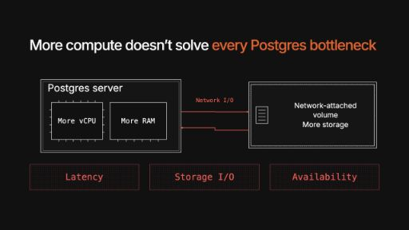

# PlanetScale diagram lab

A working demonstration of the [shared diagram framework](../../shared/presentation/README.md), using the Nexus capacity-model story. It is a development artifact, separate from interview content and site deployment.

From the repository root:

```sh
npm run build:diagrams
npm run test:diagrams
npm run serve
```

Open `/decks/diagram-lab/index.html#/capacity-model`, or the portable [Audience.html](Audience.html). Right advances through larger resources and the pressure questions; Left reverses. Continue to the next slide and return to check state restoration. `#/capacity-model/1` enters the final fragment state directly.

Edit [the canonical scene](../../shared/presentation/examples/capacity-model.json), then rebuild. `diagrams/capacity-model.json`, `runtime/`, `build.py`, `package.py`, `slides.js`, and `Audience.html` are refreshed by the lab build. Its `content.json`, `index.html`, `app.js`, and `theme.css` define the surrounding demo. The runtime registers as `ps-diagrams` and all assets are packaged locally.


